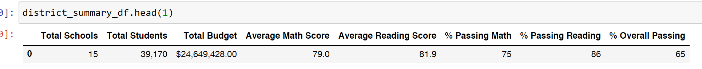
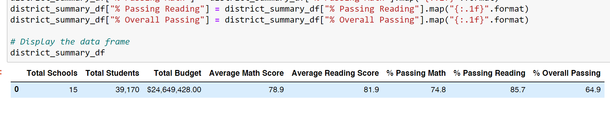
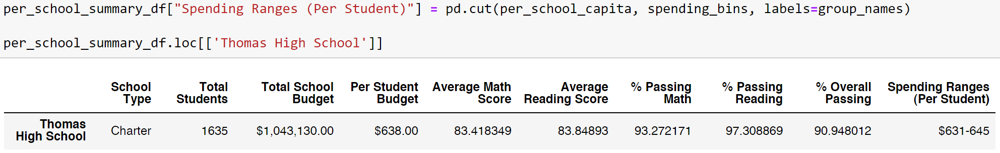
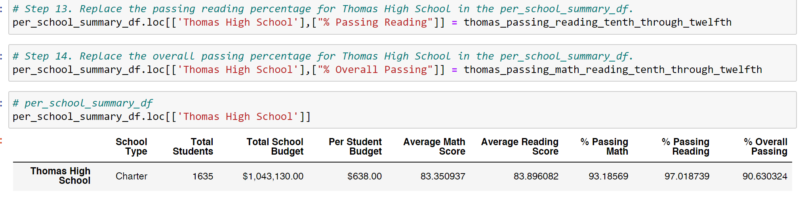
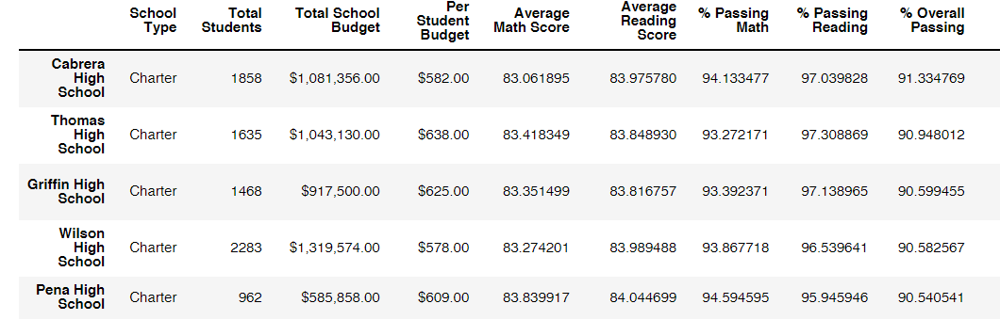
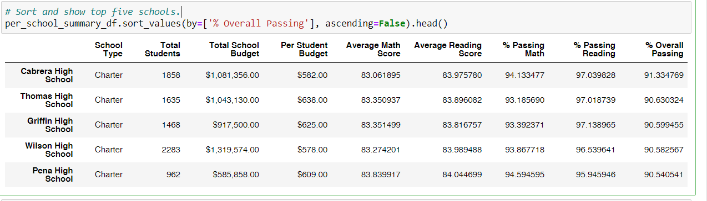

# School_District_Analysis

## Analysis Overview 

This analysis revolves around utilizing the .loc method and operators for creating and implementing replacement percentage scores for Thomas High School and the district summary due to 9th grade scores becoming corrupt from academic dishonesty. Firstly, 9th grade scores are replaced with null values. Then, we subtract all 9th graders from the overall student count to calculate new passing percentages and substitute the new scores in the district summary. Lastly, we calculate and implement the passing percentages for the Thomas High School dataframe known as per_school_summary_df.

## Analysis Results

* The new district summary has slightly lower percentages most frequently differing by about .1%

Old Summary

New Summary

* The overall passing percentage of the Thomas High School summary decreased by about .3%

Old Summary

New Summary

* With the .3% decrease in the overall passing percentage, Griffin High is now .03% away from taking Thomas High School's second place status on the district board.

Old Board

New Board

* Substituting null values for the 9th grade in Thomas High School has had the following affects:
  * 9th grade in math and reading scores by grade show as null
  * The '$631-645' range in Scores by school spending for all average scores and percentages passing has shifted downward the greatest change being close to .1%
  * The 'Medium (1000-1999)' range	in scores shifted downward by about .01%
  * The 'Charter' school type shifted down commonly by about .03% for all features
 

## Analysis Summary

Now that 9th graders have been formally removed from the Thomas High School dataframe, any call for 9th grade appears as null in analysis. With nullification of the 9th grade, Thomas High School has become incredibly close to being passed by Griffin High School in the district board. The overall passing percentage has decreased by .1% making it a fairly non-catastrophic event. 
